# 서울 3반 4조 Final Project - Guns & Movies

## i. 팀원 정보 및 업무 분담 내역

1. **변정호(조장)**
   - 총기를 영화에 접목시키자는 아이디어 발안
   - 총과 영화가 연결된 데이터를 가진 참고 사이트 발견
   - 서비스에 사용할 총기 선정 및 DB 입력
   - Gamification을 이용한 영화 추천 서비스 구현
   - 유저 프로필, 총기 디테일, 영화 디테일 페이지 스타일링
   - CSS animation이 포함된 랜딩 페이지 제작
   - 서비스의 메인 컬러 선정
   - 메인 페이지의 캐러셀과 각 페이지의 좋아요 버튼 html/css 소스 확보
   - 발표 자료 준비 및 발표
2. **최병성(조원)**
   - 회원 탈퇴 기능 구현(탈퇴한 회원이 작성한 리뷰, 댓글 유지)
   - 검색어를 입력하면 TMDB에서 그 검색어에 맞는 영화들을 출력하여, 그 중 원하는 영화를 DB에 저장하는 기능 구현
   - DB에 저장된 총기 정보에 맞게 imfdb.org 사이트를 크롤링해서 총이 출연하는 영화 제목들을 가져오고 , 그 영화 제목으로 TMDB에서 영화들을 조회해서 DB에 저장하며, 등록된 총기와 연결시켜 주는 기능 구현
   - 메인 페이지의 캐러셀과 각 페이지의 좋아요 버튼 html/css 코드 조작 및 스타일링
   - 영화 인덱스, 리뷰 인덱스, 리뷰 디테일 페이지 스타일링
   - 영화, 리뷰 정렬 기능 및 pagination 구현
   - README 작성
3. **함께 진행한 업무**
   - 서비스 ERD 그리기
   - 구현할 기능들 체크리스트 작성
   - 로그인, 회원가입, 리뷰 작성, 좋아요 등 각종 기본 기능들 구현
   - 총, 영화, 리뷰, 댓글 검색 기능 구현

##  ii. 목표 서비스 구현 및 실제 구현 정도

1. **랜딩 페이지**(구현 정도 : 100%)

   

   - 구현한 것
     - CSS animation으로 움직이는 환영 문구
     - 페이지 클릭 시 커서에서 총알이 발사되는 이펙트와 함께 격발 음성 재생
     - 총기 테마에 걸맞게 스릴감 넘치는 스타일링

2. **메인 페이지**(구현 정도: 60%)

   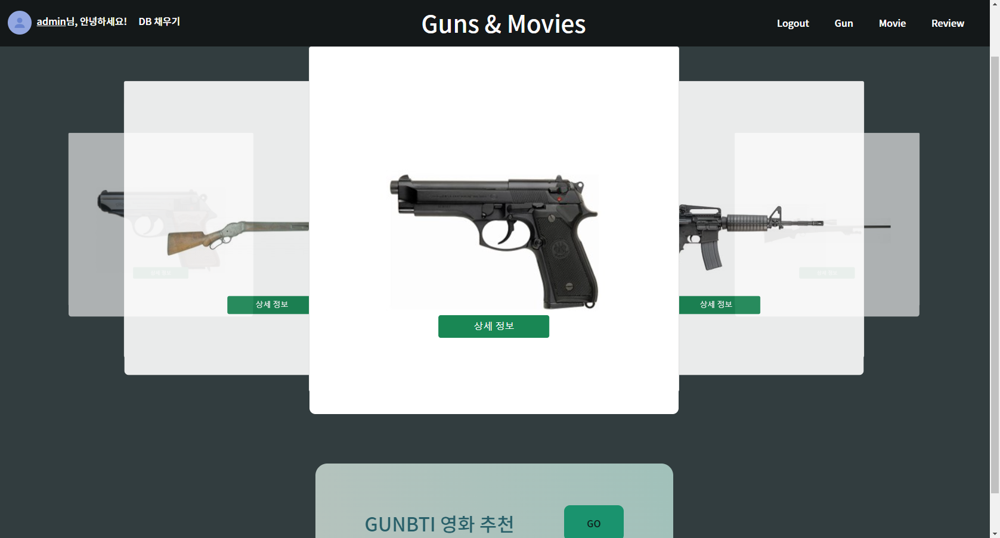

   - 구현한 것
     - 로그인, 로그아웃, 회원가입, 프로필 및 총기, 영화, 리뷰 인덱스 페이지를 오갈 수 있는 네비게이션 바
     - 특정 총기 정보들에 대한 정보를 담고 있는 캐러셀
     - Gamification으로 영화를 추천하는 알고리즘
   - 구현하지 못한 것
     - 네비게이션 바와 배경화면을 좀 더 보기 좋게 스타일링
     - 캐러셀에 있는 총기를 클릭 시 확대된 총기 이미지와 각종 기능 버튼들이 첨가된 modal이 팝업되는 기능
     - 메인 페이지에 총과 영화를 연관지은 이유 등에 대한 설명을 더 채워넣어 풍부한 볼거리를 제공하기

3. **프로필 페이지**(구현 정도: 80%)

   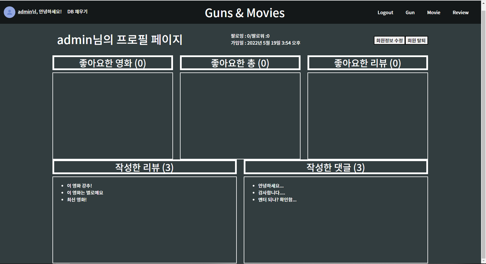

   - 구현한 것
     - 해당 유저의 좋아요한 영화, 총, 리뷰, 팔로잉 수, 팔로워 수, 가입일, 작성한 리뷰, 댓글 목록 출력
     - 해당 유저가 타인일 경우 팔로우 가능
     - 해당 유저가 자신일 경우 회원정보 수정 및 회원탈퇴 기능
   - 구현하지 못한 것
     - 팔로잉 유저 및 팔로워 유저 확인 기능
     - 사용자가 프로필 이미지 등록하여 수정할 수 있는 기능

4. **DB 채우기 페이지**(구현 정도: 80%)

   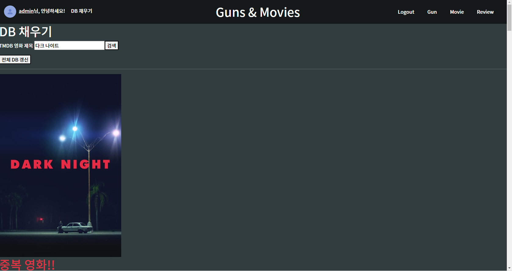

   - 구현한 것
     - 관리자만 열람 및 이용 가능
     - 특정 검색어로 영화를 검색하면 TMDB API에서 영화 목록들을 가져와 출력하는 기능
     - 버튼을 누르면 현재 서비스에 등록되어 있는 총기들의 이름을 가지고 imfdb.org 사이트를 크롤링해서 각 총기들이 등장하는 영화들의 제목을 받아오고, 영화 제목들로 TMDB API에서 해당 영화를 가져와 DB에 저장한 후, 저장된 영화에 해당되는 총기를 연결시켜주는 기능
   - 구현하지 못한 것
     - 검색을 통해 출력된 영화들을 특정 기준으로 정렬하는 기능
     - 테마에 걸맞는 CSS로 스타일링

5. **회원가입/로그인 페이지**(구현 정도: 40%)

   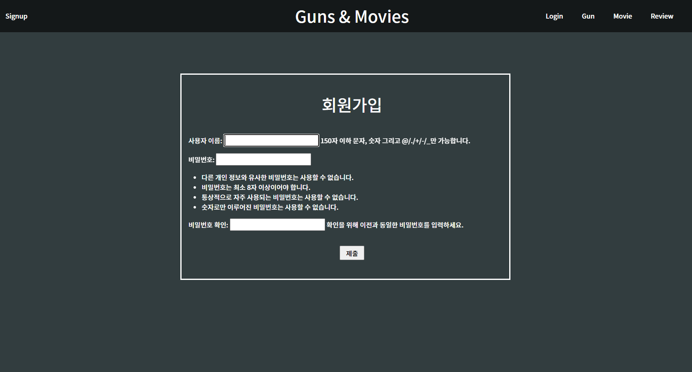

   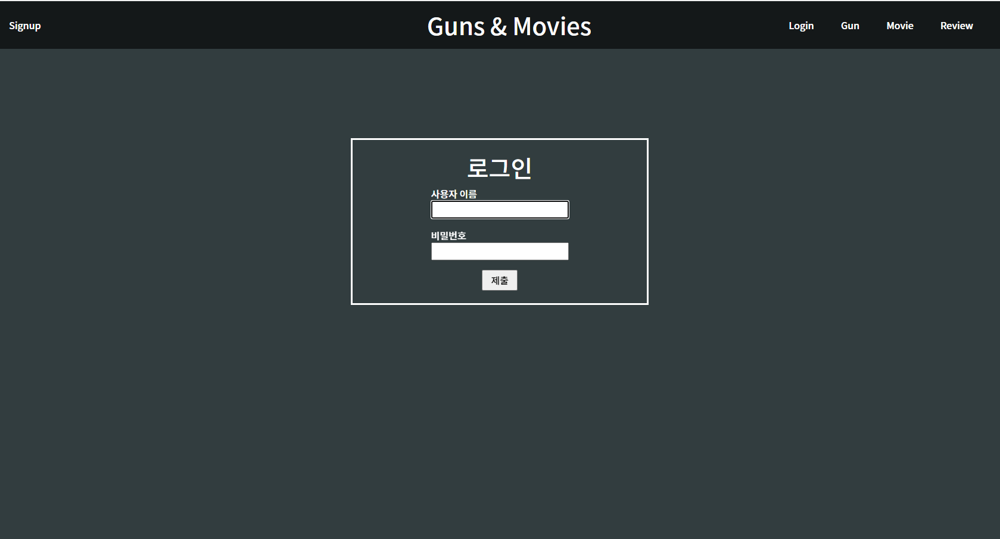

   - 구현한 것
     - 아이디와 비밀번호를 입력하여 회원가입, 로그인 시키는 기능
   - 구현하지 못한 것
     - 카카오톡 등 외부 API를 이용한 회원가입, 로그인 기능
     - 없는 아이디, 잘못된 비밀번호로 로그인할 경우 안내 문구 출력

6. **회원정보 수정/비밀번호 수정 페이지**(구현 정도: 30%)

   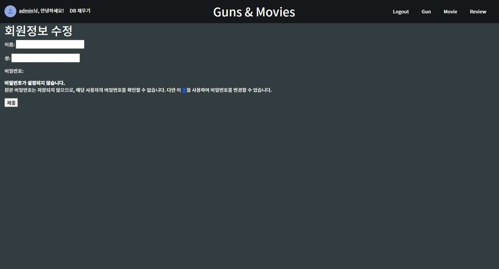

   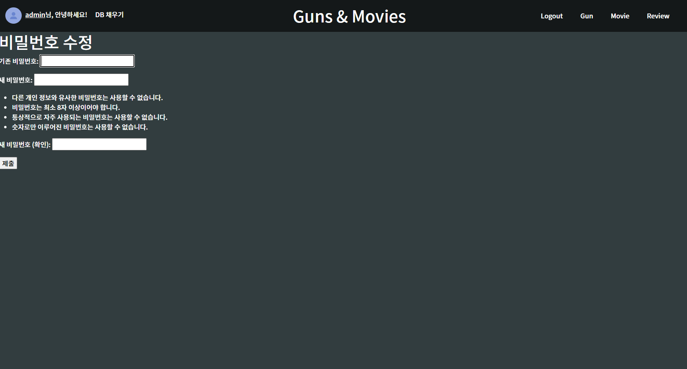

   - 구현한 것
     - 회원정보, 비밀번호 수정 기능
   - 구현하지 못한 것
     - 테마에 걸맞는 CSS로 스타일링
     - 유저가 좋아하는 영화 장르 등 회원정보 모델링을 풍부하게 채우고 수정가능하게 하기
     - 비밀번호 수정 폼을 django의 기존 방식이 아닌 다른 방식으로 접근 가능하도록 수정

7. **총 인덱스 페이지**(구현 정도: 60%)

   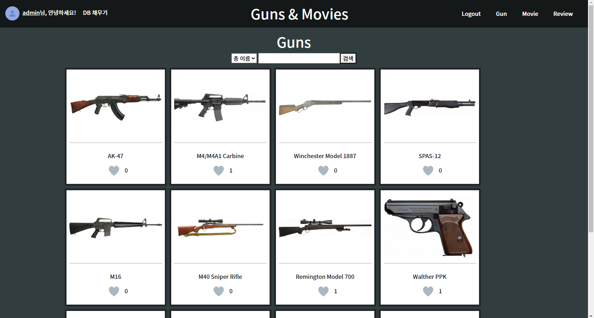

   - 구현한 것
     - DB에 등록된 모든 총기들의 이미지와 이름을 카드 형태로 출력
     - 각 총기들에 대한 좋아요 기능 및 좋아요 버튼의 실시간 변화
     - 총의 이름과 종류로 총을 검색하는 기능
   - 구현하지 못한 것
     - 총기들을 특정 기준으로 정렬하는 기능
     - 서비스에서 취급하는 총기들의 수가 많아질 경우를 대비한 pagination
     - 로그인 하지 않았을 경우 좋아요 버튼을 비활성화

8. **총 디테일 페이지**(구현 정도: 90%)

   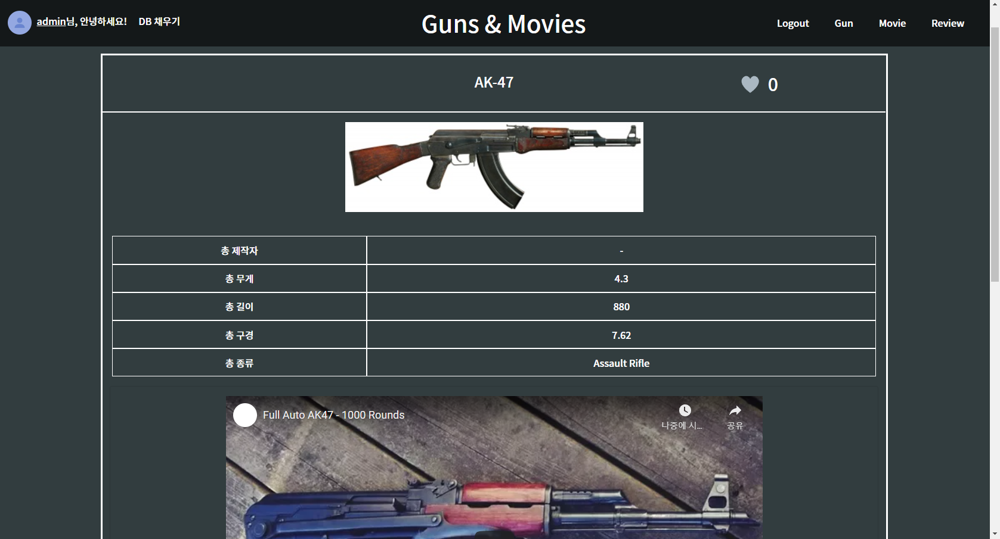

   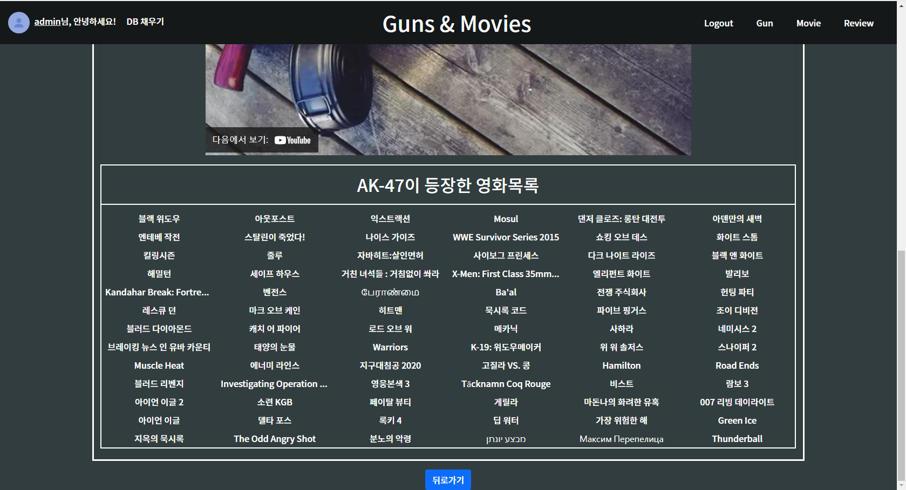

   - 구현한 것
     - 해당 총기의 상세정보들을 출력
     - 해당 총기에 대한 좋아요 기능 및 좋아요 버튼의 실시간 변화
     - 해당 총기에 관련된 유튜브 영상 출력
     - DB에 저장된, 해당 총기가 출연하는 영화 목록 출력 및 각 영화의 디테일 페이지로 이동하는 기능
   - 구현하지 못한 것
     - 로그인 하지 않았을 경우 좋아요 버튼을 비활성화

9. **영화 인덱스 페이지**(구현 정도: 90%)

   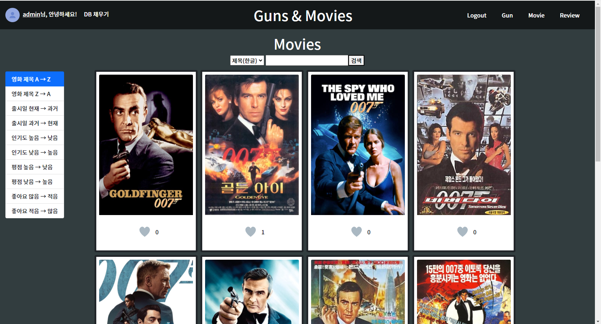

   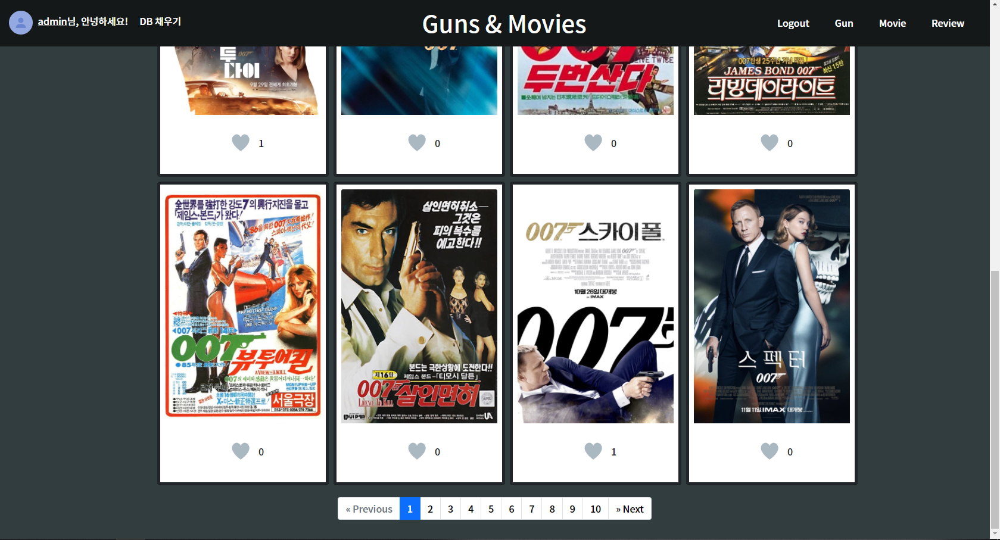

   - 구현한 것
     - DB에 등록된 모든 영화들의 이미지를 카드 형태로 출력
     - 각 영화들에 대한 좋아요 기능 및 좋아요 버튼의 실시간 변화
     - 영화의 제목, 원제, 장르로 영화를 검색하는 기능
     - 영화들을 제목, 출시일, 인기도, 평점, 좋아요 수를 기준으로 정렬하는 기능
     - 출력되는 영화 목록에 대한 pagination
     - 테마에 걸맞는 CSS로 스타일링
   - 구현하지 못한 것
     - 로그인 하지 않았을 경우 좋아요 버튼을 비활성화

10. **영화 디테일 페이지**(구현 정도: 80%)

    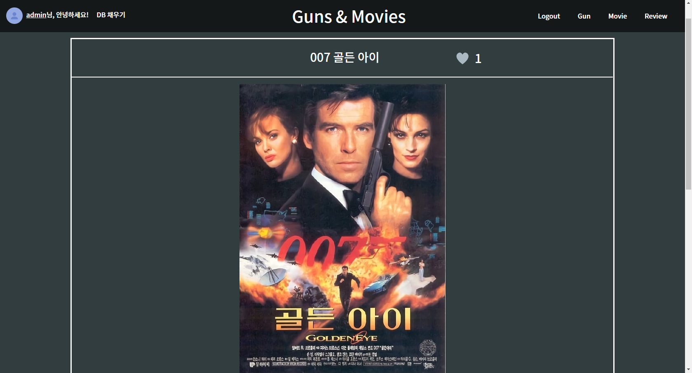

    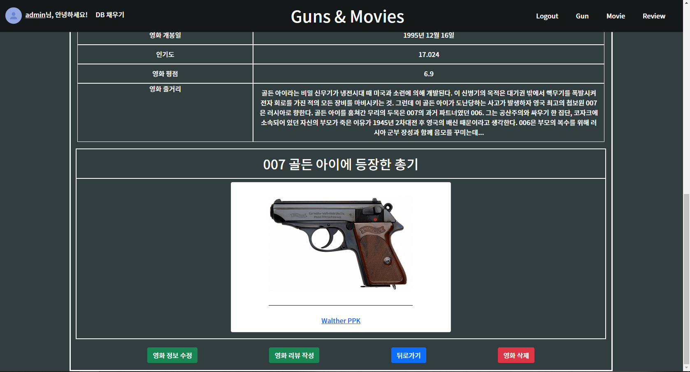

    - 구현한 것
      - 해당 영화의 상세정보들을 출력
      - 해당 영화에 대한 좋아요 기능 및 좋아요 버튼의 실시간 변화
      - DB에 저장된, 해당 영화에 출연하는 총기 목록 출력 및 각 총기의 디테일 페이지로 이동하는 기능
      - 영화에 대한 리뷰 작성 기능
      - 관리자일 경우 영화 정보를 수정 및 삭제할 수 있는 기능
    - 구현하지 못한 것
      - 해당 영화에 관련된 유튜브 영상 출력
      - 로그인 하지 않았을 경우 좋아요 버튼을 비활성화

11. **영화 정보 수정 페이지**(구현 정도: 50%)

    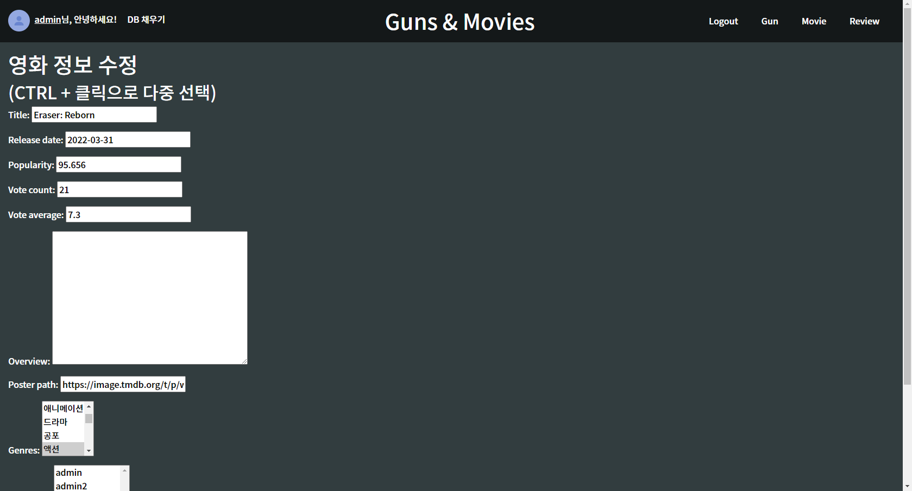

    - 구현한 것
      - 관리자 권한으로 영화 정보를 수정할 수 있는 기능
    - 구현하지 못한 것
      - 테마에 걸맞는 CSS로 스타일링

12. **리뷰 인덱스 페이지**(구현 정도: 90%)

    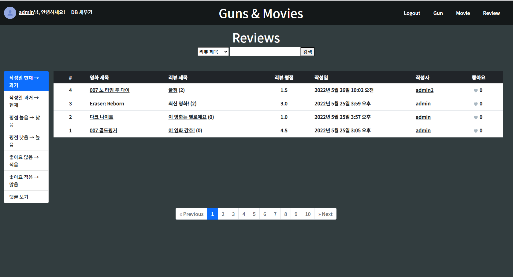

    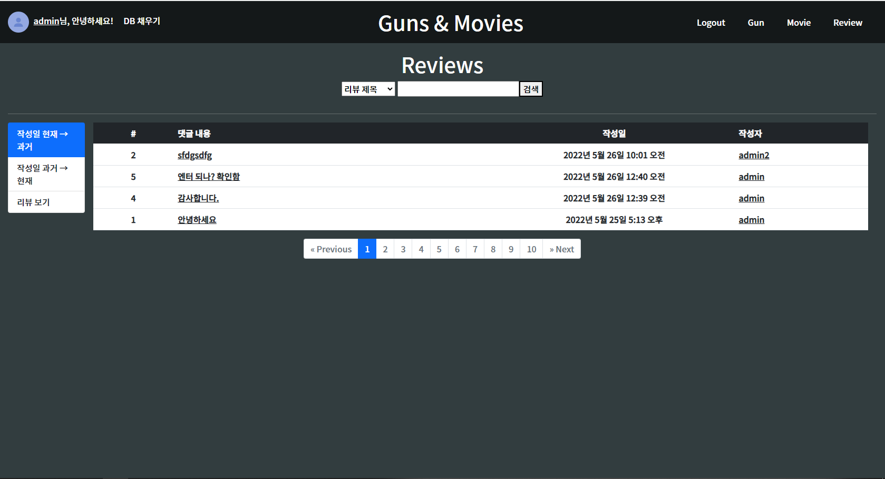

    - 구현한 것
      - DB에 등록된 모든 리뷰들 혹은 댓글들의 정보를 테이블 형태로 출력
      - 각 리뷰들에 대한 좋아요 기능 및 좋아요 버튼의 실시간 변화
      - 리뷰의 제목, 내용, 작성자, 리뷰에 관련된 영화 제목, 댓글 내용, 댓글 작성자로 리뷰 혹은 댓글을 검색하는 기능
      - 리뷰들을 작성일, 평점, 좋아요 수를 기준으로, 댓글들을 작성일을 기준으로 정렬하는 기능
      - 출력되는 리뷰 목록 혹은 댓글 목록에 대한 pagination
      - 영화 제목, 작성자를 클릭하면 해당 영화의 디테일 페이지, 작성자의 프로필 페이지로 이동하는 기능
      - 테마에 걸맞는 CSS로 스타일링
    - 구현하지 못한 것
      - 로그인 하지 않았을 경우 좋아요 버튼을 비활성화

13. **리뷰 디테일 페이지**(구현 정도: 70%)

    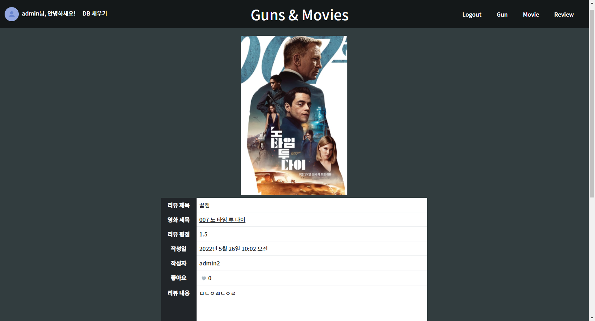

    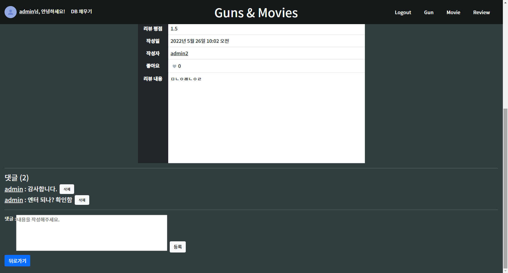

    - 구현한 것
      - 해당 리뷰의 상세정보들을 출력
      - 해당 리뷰에 대한 좋아요 기능 및 좋아요 버튼의 실시간 변화
      - 해당 리뷰와 관련된 영화의 이미지를 출력, 영화 제목을 클릭하면 해당 영화의 디테일 페이지로 이동하는 기능
      - 리뷰 작성자일 경우 리뷰를 수정 및 삭제할 수 있는 기능
      - 해당 리뷰에 대한 댓글을 작성할 수 있는 기능
      - 로그인하지 않은 유저에게 댓글 작성을 위한 로그인을 유도하는 기능
      - 댓글 작성자일 경우 댓글을 삭제할 수 있는 기능
      - 댓글 작성자의 프로필 페이지로 이동하는 기능
      - 테마에 걸맞는 CSS로 스타일링
    - 구현하지 못한 것
      - 로그인 하지 않았을 경우 좋아요 버튼을 비활성화
      - 리뷰 내용, 댓글 내용 항목의 줄바꿈 기능 구현
      - 댓글 작성자일 경우 댓글을 수정하는 기능

14. **리뷰 작성/수정 페이지**(구현 정도: 90%)

    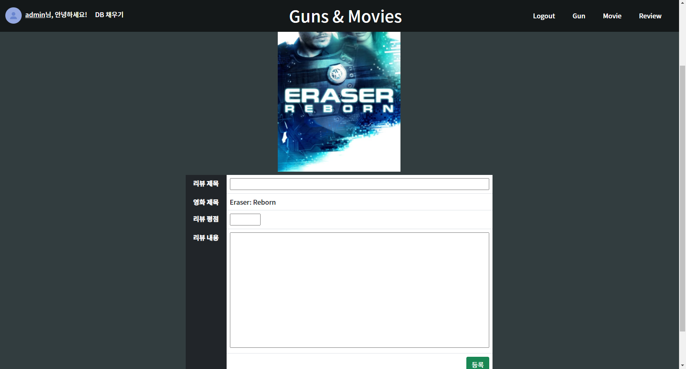

    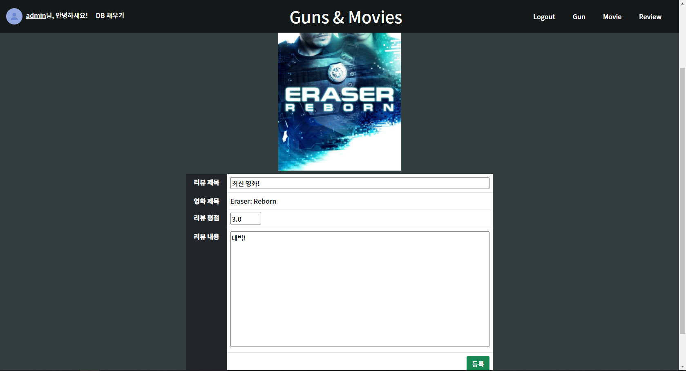

    - 구현한 것
      - 작성/수정하려는 리뷰에 연관된 영화의 이미지와 제목을 출력하는 기능
      - 해당 영화에 대한 리뷰 제목, 내용을 작성/수정하고 평점을 매길/바꿀 수 있는 기능
      - 테마에 걸맞는 CSS로 스타일링

    - 구현하지 못한 것
      - 리뷰 내용(textarea) 항목의 줄바꿈 기능

## iii. 데이터베이스 모델링 (ERD)

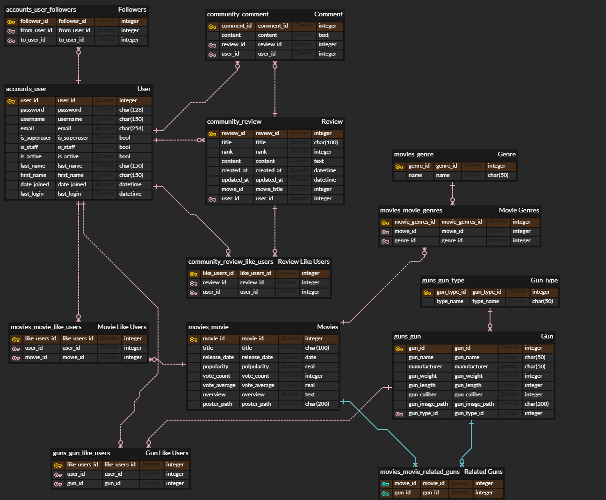

## iv. 필수 기능에 대한 설명

1. **GunBTI**

   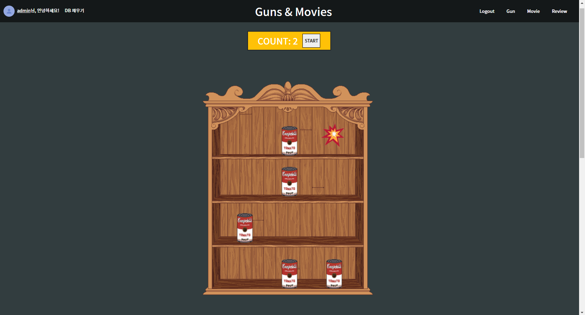

   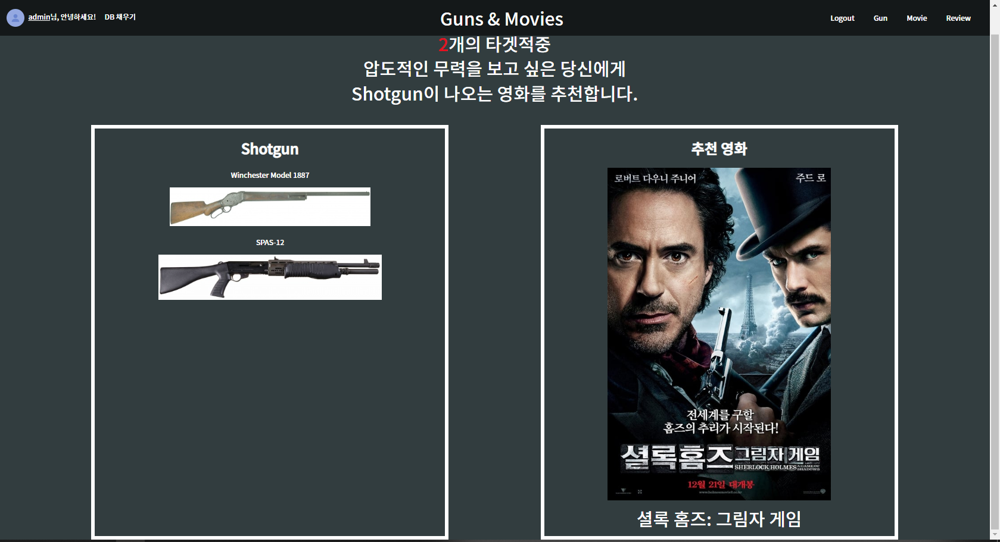

   - 게임을 통해 영화를 추천
     - 책장의 랜덤한 자리에 통조림이 나타나고, 그 통조림을 마우스로 쏴서 쓰러뜨릴 수 있는 게임을 진행
     - 10초간 게임을 진행하여 유저는 원하는 만큼 통조림을 쓰러뜨림
     - 쓰러뜨린 통조림의 개수로 유저의 성향을 파악하여 걸맞는 총기류를 추천
     - 추천된 총기류의 총기가 출연하는 영화를 하나 랜덤하게 추천

2. **DB 채우기**

   

   - 관리자용 DB 채우기 기능
     - 검색을 하면 검색어로 TMDB API에서 영화들을 조회하여 화면에 출력
     - 각 영화 정보에 있는 `영화 DB 등록 `버튼을 누르면 해당 영화의 정보를 DB에 저장할 수 있음
     - `전체 DB 갱신` 버튼을 누르면 현재 DB에 저장된 모든 총기에 대해서  imfdb.org 사이트에서 크롤링을 진행하고, 해당 사이트에서 각 총기들이 등장하는 영화 제목들을 가져옴
     - 가져온 영화 제목들로 TMDB API에 영화들을 조회하여 영화 정보를 DB에 저장한 후, 총기와 영화의 연결 관계도 저장함

3. **정렬 기능**

   

   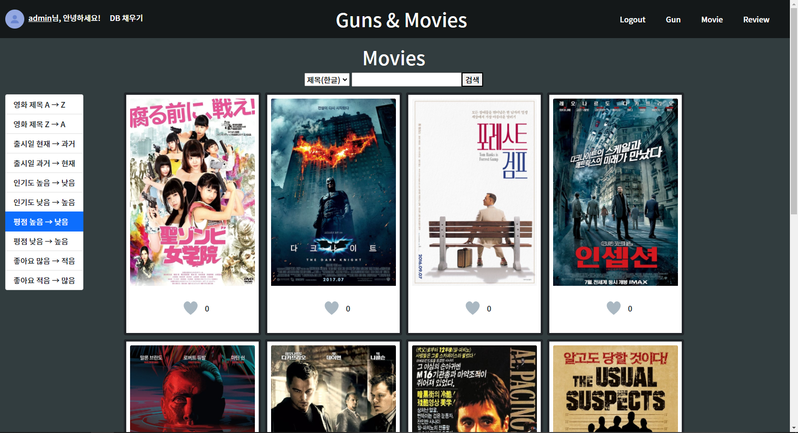

   - 수많은 영화/리뷰/댓글들을 정렬하는 기능
     - 영화들을 제목순, 제목역순, 출시일순, 출시일역순, 인기도순, 인기도역순, 평점순, 평점역순, 좋아요순, 좋아요역순을 기준으로 정렬 가능
     - 정렬된 영화들은 각 페이지에 12개씩 출력되며, 다른 페이지로 넘어가 영화들을 조회 가능
     - 리뷰들을 작성일순, 작성일역순, 평점순, 평점역순, 좋아요순, 좋아요역순을 기준으로 정렬 가능
     - 댓글들을 작성일순, 작성일역순으로 정렬가능
     - 리뷰/댓글들은 각 페이지에 15개씩 출력되며, 영화와 마찬가지로 다른 페이지로 넘어가 리뷰/댓글들을 조회 가능

## v. 느낀 점

1. **변정호**
   - 주어진 명세대로만 개발하는 것이 아닌, 팀의 아이디어를 통해 바닥부터 무언가를 만들어 나가는 것이 재밌었으며 큰 동기부여가 되었다.
   - 협업과 버전관리를 위한 깃(Git)이지만 오히려 깃이 무서워 제대로된 분업을 하지 못했다. 충돌과 이로 인한 그동안의 시간과 노력이 한순간에 사라질까 push와 pull을 자유롭게 하지 못했는데, 분명 더 나은 협업환경을 구축할 방법이 있었을테지만 이미 프로젝트가 진행된 시점에서 새로운 시도를 하기가 쉽지 않았다.
   - 페이지 디자인에 소요되는 시간은 항상 예상보다 훨씬 많이 걸린다. 파이썬과 장고를 활용한 백엔드 기능들을 구현하는 것이 시간을 많이 소요할 것이라 예상해 css, javascript를 활용한 페이지 디자인을 조금씩 뒤로 미루었는데 결국 초기 계획한 특색있는 디자인들을 포함시킬 여유가 부족했다.
   - CSS, Javascript를 활용한 페이지 디자인을 trial and error 방식으로 코드를 하나 수정할 때마다 확인해가며 의도했던 결과물이 나오는지 확인하였는데, 진행을 하면서도 이렇게 개발하는 것이 맞는지에 대한 의문이 생겼다. 현업의 프론트엔드 개발자들의 개발방식에 대한 궁금증이 생겼다.
2. **최병성**
   - 여태까지 배웠던 프로그래밍 지식들을 유감없이 발휘할 수 있어서 재밌었다. 특히 DB를 채우는 기능을 구현하기 위해 크롤링과 API 서버를 활용할 때 좀더 개발자에 가까워진 것 같은 기분이 들었다. 또한 서비스를 개발하면서 새로운 문법들과 프로그래밍 지식들도 알게 됐는데, 처음에는 도저히 이해하지 못해서 사용할 수 없었지만 시간이 지나서 그것들을 자유자재로 다루는 나 자신을 발견하여 매우 놀라웠다.
   - 우리의 서비스가 소규모의 서비스라고 너무 얕본 것 같다. 이런 단순한 서비스조차도 개발하는 데 생각보다 많은 시간과 노력이 필요했고, 결국 서비스 개발 스케쥴 관리에 실패했다. 분명 프로젝트를 시작할 때는 좀더 잘 꾸며지고 빈틈도 없는 서비스를 개발할 것이라고 생각했었지만, 막상 마감일이 다가오니 생각보다 많은 빈틈들이 보이고 외관상 잘 꾸며지지도 못한 것 같다. 다음 번에 프로젝트를 진행하게 된다면 좀 더 현실적으로 스케쥴을 고려해야 할 것 같다.